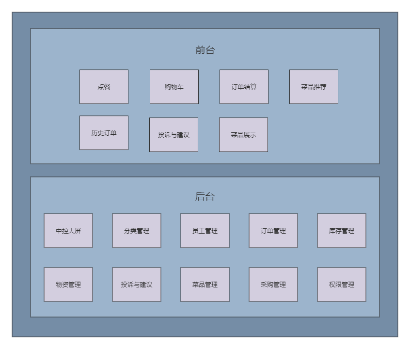

# 餐馆物资管理平台

## 项目介绍

本项目是适合餐馆使用的点单及后台物资管理平台，基于Spring Boot + MyBatis Plus实现。该平台包含以下功能：

- 管理各种菜品，以及菜品涉及的物资；
- 能够提供小程序点单功能，集成了支付系统；
- 可根据用户的历史点餐数据向用户推荐可能感兴趣的菜品；
- 能够将各种菜品与原材料数量进行挂钩，并统计各种原材料的耗费情况；
- 带有中控大屏，展示各个餐位的用餐时间、人数、所点菜品以及相关信息；
- 每天汇报各种材料的库存情况、进货时间、可用时长；
- 可根据后台预设的材料采购阈值信息生成购物清单。

## 项目文档

[UI设计文档](./doc/UI设计文档.pdf)

[接口设计文档](./doc/接口设计文档.pdf)

[使用说明文档](./doc/使用说明文档.pdf)

[数据库文档](./doc/数据库文档.pdf)

[用户故事文档](./doc/用户故事文档.pdf)

## 组织结构

```text
restaurant
|-- common #通用返回结果
|-- config #配置类
|-- controller #控制层
|-- filter #过滤器
|-- mapper #持久层
|-- model #实体类
|-- service #业务逻辑层
|-- utils 工具类及通用代码
```

## 技术选型

| 技术                   | 说明             | 官网                                                         |
| ---------------------- | ---------------- | ------------------------------------------------------------ |
| Spring Boot            | 容器 + MVC框架   | https://spring.io/projects/spring-boot                       |
| Spring Security        | 认证授权框架     | https://spring.io/projects/spring-security                   |
| MyBatis-Plus           | ORM框架          | https://baomidou.com/                                        |
| MyBatis Plus Generator | 数据层代码生成   | https://github.com/baomidou/generator                        |
| Redis                  | 分布式缓存       | https://redis.io/                                            |
| HikariCP               | 数据库连接池     | https://github.com/brettwooldridge/HikariCP                  |
| OSS                    | 对象存储         | https://github.com/aliyun/aliyun-oss-java-sdk                |
| JWT                    | JWT登录支持      | https://github.com/jwtk/jjwt                                 |
| Lombok                 | 简化对象封装工具 | https://github.com/rzwitserloot/lombok                       |
| Swagger UI             | 文档生成工具     | https://github.com/swagger-api/swagger-ui                    |
| Hibernator Validator   | 验证框架         | http://hibernate.org/validator                               |
| emoji-java             | emoji表情转码    | https://github.com/vdurmont/emoji-java                       |
| TestNG                 | 测试框架         | https://testng.org/doc/                                      |
| Joda-Time              | 时间处理类库     | https://www.joda.org/joda-time/                              |
| wxpay-sdk              | 微信支付依赖     | https://pay.weixin.qq.com/wiki/doc/apiv3/wxpay/pages/index.shtml |
| Mahout                 | 机器学习算法库   | https://mahout.apache.org//                                  |

## 业务架构图



## 开发工具

| 工具          | 说明                | 官网                                    |
| ------------- | ------------------- | --------------------------------------- |
| IDEA          | 开发IDE             | https://www.jetbrains.com/idea/download |
| QuickRedis    | Redis客户端连接工具 | https://quick123.net/                   |
| MobaXterm     | Linux远程连接工具   | https://mobaxterm.mobatek.net/          |
| Navicat       | 数据库连接工具      | http://www.formysql.com/xiazai.html     |
| PowerDesigner | 数据库设计工具      | http://powerdesigner.de/                |
| Axure         | 原型设计工具        | https://www.axure.com/                  |
| ProcessOn     | 流程图绘制工具      | https://www.processon.com/              |
| Snipaste      | 屏幕截图工具        | https://www.snipaste.com/               |
| Postman       | API接口调试工具     | https://www.postman.com/                |
| Typora        | Markdown编辑器      | https://typora.io/                      |

## 开发环境

| 工具  | 版本号 | 下载                                                         |
| ----- | ------ | ------------------------------------------------------------ |
| JDK   | 1.8    | https://www.oracle.com/technetwork/java/javase/downloads/jdk8-downloads-2133151.html |
| MySQL | 5.7    | https://www.mysql.com/                                       |
| Redis | 6.2.6  | https://redis.io/download                                    |

## 搭建部署

在restaurantmanpm目录下使用Maven进行打包，然后运行jar包，http://localhost:8080 即为该项目的地址。